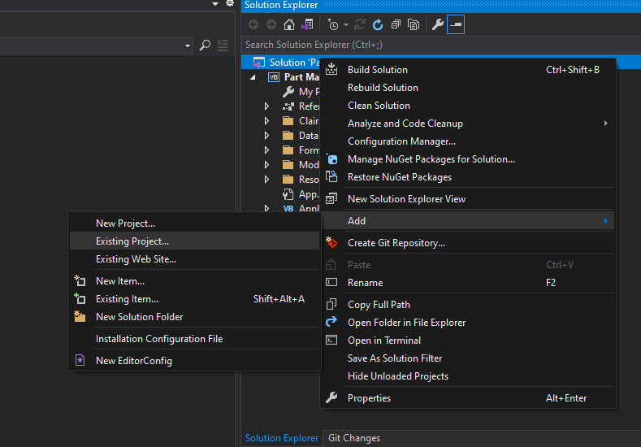
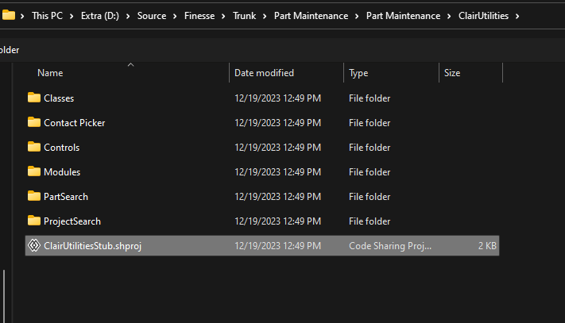

1. If the project is already a GIT repo then move to #2 - Otherwise run `GIT INIT`
2. Rename / Remove the existing ClairUtilities folder
3. Add the shared project as a Submodule - `git submodule add https://git.clairglobal.net/Finesse/ClairUtilities.git`
4. Check to ensure that the ClairUtilities folder in the project root has files - if not you can run `git clone --recurse-submodules`
5. Add the shared project to the solution:

>  
> The project file is named ClairUtilitiesStub.shproj: 
> 
6. Run a build to ensure everything works
